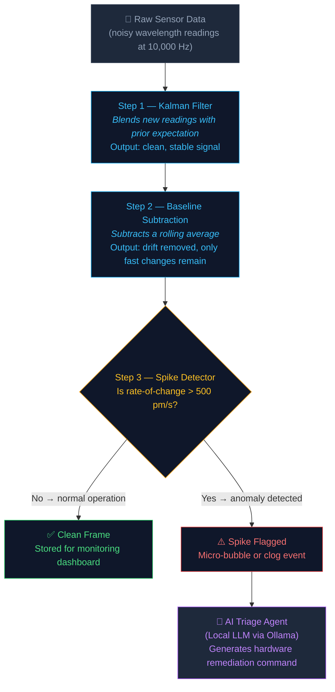

# PhotonicOps 🔬⚡


**PhotonicOps** is a 100% open-source, edge-deployed, and completely air-gapped telemetry ingestion and agentic hardware triage engine for silicon photonic biosensors. 

Designed for clinical environments where data privacy is paramount, PhotonicOps runs a local pipeline that ingests microfluidic telemetry at 10,000 samples per second, processes the signals to detect anomalies (thermal drift, micro-bubbles, clogs), and uses a local Large Language Model (LLM) to orchestrate hardware remediation—with **zero cloud API dependencies**.

---

## 🏗️ System Architecture

The system is built on a high-throughput, low-latency microservices architecture:

1. **Ingestion (Go):** A high-performance gRPC server utilizing goroutine worker pools and zero-allocation ring buffers. It captures raw optical wavelength shifts (Δλ) at $\ge 10,000\text{ Hz}$ with a $p_{99}$ latency of $< 2\text{ ms}$.
2. **DSP Pipeline (Python):** Applies 1D Kalman Filtering, baseline subtraction, and derivative thresholding to filter noise and detect physical anomalies in real-time (frame processing $< 10\text{ ms}$).
3. **Agentic Triage (Python + Local LLM):** When the signal-to-noise ratio drops below 12 dB, the system triggers a local Llama 3.1 (8B) model via Ollama. Using `Instructor` and `Pydantic`, the LLM generates strict, deterministic JSON commands to trigger automated hardware remediation.
4. **Observability:** Langfuse (self-hosted) traces LLM reasoning steps, while Prometheus and Grafana track ingestion metrics.
5. **Dashboard UI:** A React + TypeScript frontend providing a 30 FPS WebSocket-driven canvas plotting raw vs. filtered signals.

---

## 🧠 How the Signal Processing Works

The raw signal coming off a biosensor is messy — it has random jitter, slow temperature drift, and occasional sudden events (like a micro-bubble blocking the channel). The DSP pipeline cleans this up in three steps before any AI decision is made.

### Step 1 — Noise Smoothing (Kalman Filter)
Every sensor reading has a small amount of random electrical noise that makes the signal jitter up and down unpredictably. The **Kalman filter** removes this by acting as a trust manager: instead of blindly trusting every new reading, it blends the new reading with what it already expected, based on how noisy the sensor is known to be. The output is a clean, stable version of the same signal. Its weighting is calculated once at startup (not per-sample), keeping per-frame processing well under 10 ms.

### Step 2 — Drift Removal (Baseline Subtraction)
Even after noise is removed, the signal slowly wanders up or down over time due to temperature changes in the lab. This is called **thermal drift** — it is not a real biological event, just physics. We compute a rolling average of the signal and subtract it, leaving only the fast-moving changes that actually matter.

### Step 3 — Anomaly Detection (Spike Detector)
After cleaning the signal, we watch **how fast** it is changing. A slow drift is normal; a sudden sharp jump (e.g., a 50 pm change in under 100 ms) means something physically happened — a micro-bubble passed the sensor, or a cell clogged the channel. If the rate of change exceeds a configurable threshold (default: 500 pm/s), it is flagged as an anomaly and the AI triage agent is notified.

### Why this order matters
The spike detector runs **after** the Kalman filter, not the raw signal. This is intentional — running on raw noisy data would produce constant false alarms. The Kalman filter eliminates the noise first so the spike detector only sees real physical events.



---

## 🛠️ Tech Stack

* **Ingestion Engine:** Go, `google.golang.org/grpc`
* **Signal Processing (DSP):** Python, `NumPy`, `SciPy`, `FilterPy`
* **Local AI Agent:** Ollama / vLLM (`llama3.1:8b` or `qwen2.5:7b`)
* **Schema Enforcement:** `Instructor-Python`, `Pydantic`
* **MLOps & Tracing:** Langfuse (Docker), Promptfoo (CLI)
* **Metrics & UI:** Prometheus, Grafana, React, TypeScript, Tailwind CSS, Chart.js
* **Orchestration:** Docker, Docker Compose

---

## 📊 Telemetry Data Model & Mock Sensor

In silicon photonic biosensors (such as microring resonators), the primary signal measured is the **resonance wavelength shift (Δλ)**, typically measured in picometers (pm). As target molecules bind to the sensor's surface, the refractive index changes, causing a measurable shift in the wavelength.

The **Mock Sensor** (`scripts/simulate_sensor.go`) blasts synthetic gRPC `OpticalFrame` messages to the ingestion engine at 10,000 Hz. The payload structure is defined in `proto/telemetry.proto`:

```protobuf
message OpticalFrame {
    int64 timestamp = 1;         // Unix timestamp in nanoseconds
    string sensor_id = 2;        // Unique identifier (e.g., "ring-01")
    double wavelength_shift = 3; // Shift in picometers (Δλ)
}
```

To accurately test the Digital Signal Processing (DSP) and AI Agent layers, the mock sensor injects realistic physical noise and anomalies into the `wavelength_shift`:
1. **White Noise:** System and laser noise (Gaussian, e.g., σ = 0.5 pm).
2. **Thermal Drift:** Low-frequency, slow baseline wandering caused by temperature fluctuations (e.g., ±5 pm over an hour).
3. **Bubble Spikes:** High-frequency, sudden, massive spikes (e.g., +500 pm for 1 second) simulating air bubbles passing over the microfluidic channel.

The Python DSP pipeline is responsible for filtering out the thermal drift and detecting the bubble spikes, which subsequently triggers the AI Agent to issue a hardware remediation command (e.g., "increase microfluidic pump pressure to clear the bubble").

---
## 🚀 Getting Started

### Prerequisites
* Docker and Docker Compose
* Minimum 16GB RAM
* GPU (NVIDIA/Apple Silicon) is highly recommended for Ollama inference latency

### Quick Start

> **Run each block in a separate terminal tab** — the Go server, Python DSP agent, and mock sensor are three long-running processes that must all be alive simultaneously.

#### Step 1 — Clone the repository
```bash
git clone https://github.com/Clint-Mathews/PhotonicOps.git
cd PhotonicOps
```

#### Step 2 — Start the supporting infrastructure
Spins up Ollama (local LLM), Langfuse (LLM tracing), Prometheus, and Grafana in Docker containers in the background. Wait ~30 seconds for all services to be healthy before proceeding.
```bash
docker-compose up -d

# Verify everything is running — all containers should show "Up"
docker-compose ps
```

#### Step 3 — Start the Go ingestion server *(Terminal 1)*
Starts the high-throughput gRPC server that listens on port `50051` for incoming sensor frames. It maintains a zero-allocation ring buffer per sensor and a worker pool to forward batches to the Python DSP agent over a Unix socket.
```bash
go run services/ingestion-go/cmd/server/main.go
```
You should see: `gRPC server listening on :50051`

#### Step 4 — Start the Python DSP agent *(Terminal 2)*
Activates the virtual environment, then starts the Python signal-processing service. It opens a Unix domain socket at `/tmp/photonicops-dsp.sock` and waits for the Go server to forward frame batches. Each batch is run through the Kalman filter → baseline subtraction → spike detector pipeline.
```bash
cd services/dsp-agent-python
source .venv/bin/activate      # activate the Python virtual environment
python -m src.main             # start the DSP gRPC listener
```
You should see: `DSP IPC server listening on unix: /tmp/photonicops-dsp.sock`

#### Step 5 — Run the mock sensor *(Terminal 3)*
Blasts synthetic biosensor data at 10,000 frames/sec over gRPC to the Go server. The mock signal includes realistic thermal drift and injected bubble spikes so the full DSP pipeline can be validated end-to-end without physical hardware.
```bash
go run scripts/simulate_sensor.go
```
You should see spike warnings appear in the Python DSP terminal as the injected anomalies are detected.

#### Step 6 — Verify the observability stack *(optional)*
| Service | URL | What it shows |
|---|---|---|
| Langfuse | http://localhost:3000 | LLM triage decision traces |
| Grafana | http://localhost:3001 | Ingestion throughput metrics |
| Prometheus | http://localhost:9090 | Raw metrics scrape targets |

#### Running the DSP test suite
```bash
cd services/dsp-agent-python
source .venv/bin/activate

# Run all unit tests
pytest tests/

# Run with benchmark timing (validates the <10 ms/frame NFR)
pytest tests/test_pipeline_benchmark.py -v --benchmark-only
```
