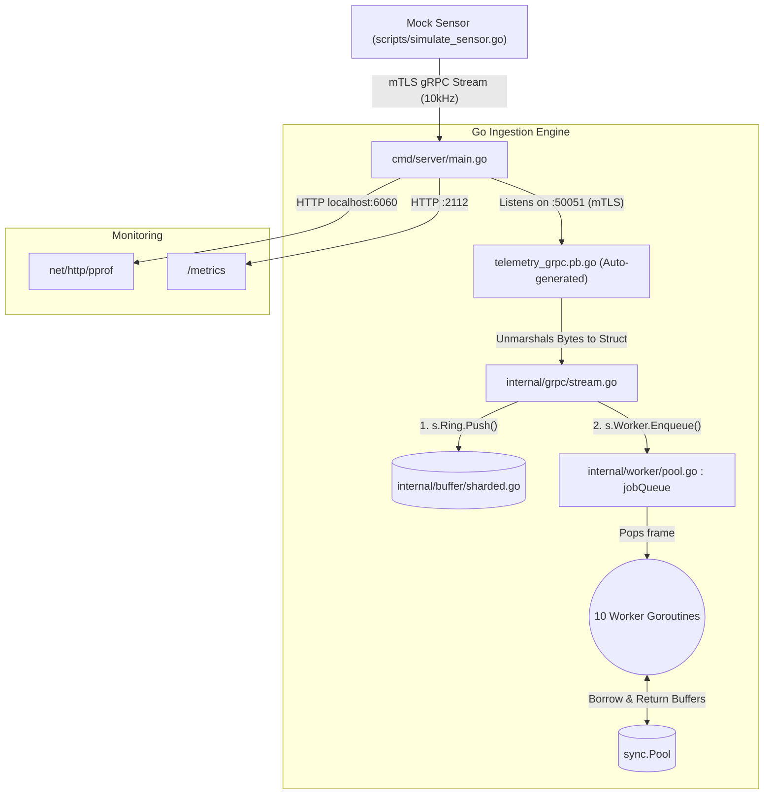

# Phase 1: Ingestion Engine FAQ

This document captures the core architectural concepts, concurrency mechanics, and memory management strategies used in the Phase 1 zero-allocation gRPC ingestion engine.

---

## Architecture Diagram & Data Flow

### How the Files Connect
1. **`pb/telemetry.pb.go` & `pb/telemetry_grpc.pb.go`**: Auto-generated files that translate raw network bytes into Go structs.
2. **`cmd/server/main.go`**: The entrypoint that creates the sharded ring and worker pool, loads mTLS creds, and opens TCP port 50051.
3. **`internal/grpc/mtls.go`**: Server TLS helper (`RequireAndVerifyClientCert`, TLS 1.3).
4. **`internal/grpc/stream.go`**: The "traffic cop". It catches incoming frames in an endless loop and pushes them to both the ring and the worker pool channel.
5. **`internal/buffer/ringbuffer.go` / `sharded.go`**: Fixed-size circular buffer per `sensor_id` holding ~1 second of data without triggering allocations on `Push`.
6. **`internal/worker/pool.go`**: Holds a `jobQueue` channel and 10 goroutines. Default `Enqueue` blocks; `--load-shed` drops when full.

---

### Q1: How do the ring buffer and worker pool work together when a stream of messages arrives at 10,000 Hz?
The `StreamTelemetry` function acts as the traffic cop. For every incoming gRPC frame, it does two incredibly fast things:
1. **Pushes to the Ring Buffer:** It grabs a Mutex lock for a nanosecond, drops the frame into a fixed-size array, and updates the `head` pointer. This acts as a rolling 1-second "short-term memory" of the raw data, allowing a Web UI to fetch recent history without interfering with the processing layer.
2. **Enqueues to the Worker Pool:** It drops the same frame onto a buffered channel (`jobQueue`) and instantly returns to listen to the network. It **does not** wait for the processing to finish. On the other side of the channel, a pool of pre-spawned worker goroutines pulls the frames off the queue and processes them in parallel.

### Q2: Do the 10 workers fight or block each other when reading from the same `jobQueue` channel?
**No.** When multiple goroutines read from the exact same channel (`for frame := range p.jobQueue`), the Go runtime acts as a high-speed load balancer. Go guarantees that exactly **one** worker will wake up and receive the frame. They do not fight over it, data is never duplicated, and it requires zero manual locking. Whichever worker is free first gets the next frame.

### Q3: We only have one `sync.Pool`. Does sharing it cause the 10 workers to block each other when asking for memory?
**No.** `sync.Pool` is specifically engineered to be lock-free in high-throughput scenarios. Under the hood, a single `sync.Pool` object secretly maintains a private stash of memory **for each physical CPU core** on the host machine. 
If Worker 1 (running on Core A) asks for a buffer, it grabs one from Core A's private stash without locking. If Worker 2 (running on Core B) asks for one, it grabs it from Core B's stash. They only fall back to a shared lock if their private stash is empty.

### Q4: If the workers slow down and a backlog of 45,000 frames builds up in the channel, what happens to the `sync.Pool`? Does memory usage spike?
**Memory does not spike.** The 45,000 frames sitting in the channel are just pointers waiting in line. The `sync.Pool` only creates enough byte arrays to satisfy concurrent demand. Because there are only 10 workers running at maximum, the `sync.Pool` will only ever allocate exactly **10 byte arrays total**. Even if the workers are running at maximum speed to clear the 45k backlog, those same 10 arrays simply get passed back and forth between the pool and the workers millions of times. This results in a completely flat memory footprint.

### Q5: What happens if the `jobQueue` channel fills up completely (exceeds the 50,000 capacity)?
Because we are using a standard channel send (`p.jobQueue <- frame`), the system relies on **Backpressure**:
1. If the channel hits exactly 50,000 unread frames, the `Enqueue` function will block (freeze) the `StreamTelemetry` goroutine.
2. Because `StreamTelemetry` is frozen, it stops calling `stream.Recv()`.
3. The underlying Operating System TCP buffer starts to fill up with incoming sensor data.
4. Once the OS buffer is full, TCP automatically drops its window size to 0, sending a signal to the mock sensor client: *"My buffer is full, stop sending data."*

The network connection naturally throttles the client. That is still the **default**.

### Q6: What does `--load-shed` drop, and in what order relative to the ring buffer?
`--load-shed` switches `Enqueue` to a non-blocking `select`/`default`. When `jobQueue` is full, the **newest** frame (the one that could not enqueue) is dropped and `photonicops_ingestion_frames_dropped_total` increments. `StreamTelemetry` still calls `Push` before `Enqueue`, so the UI ring retains the frame even when DSP work is shed. Blocking backpressure remains the default when the flag is off.

### Q7: How do the mock sensor and ingestion server authenticate?
The TCP listener requires mutual TLS (TLS 1.3). Issue a local CA with `./scripts/generate_certs.sh`, then start the server with `certs/server.{crt,key}` and the mock sensor with `certs/client.{crt,key}`. Plaintext gRPC clients fail the handshake. The Unix-domain DSP socket does not use mTLS.
